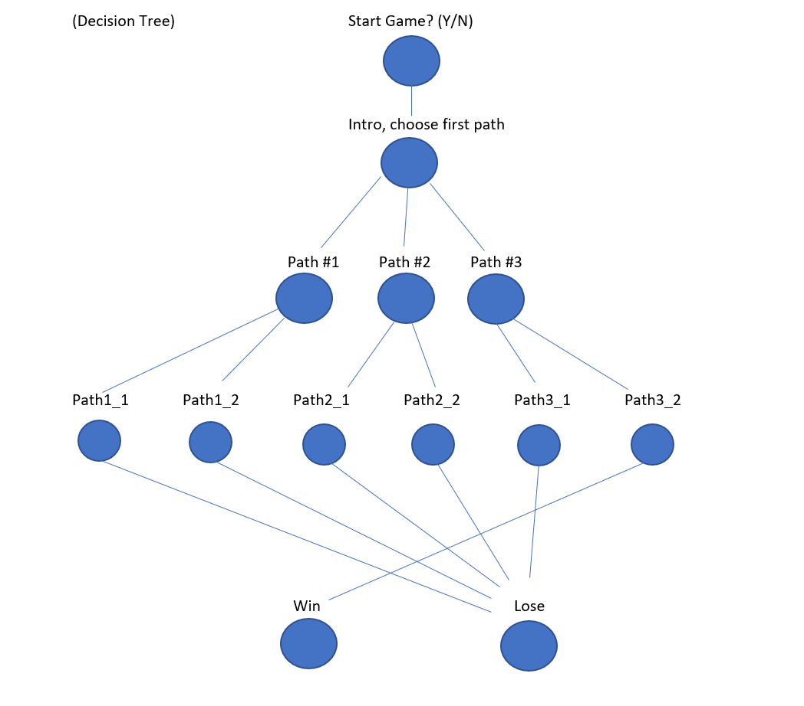
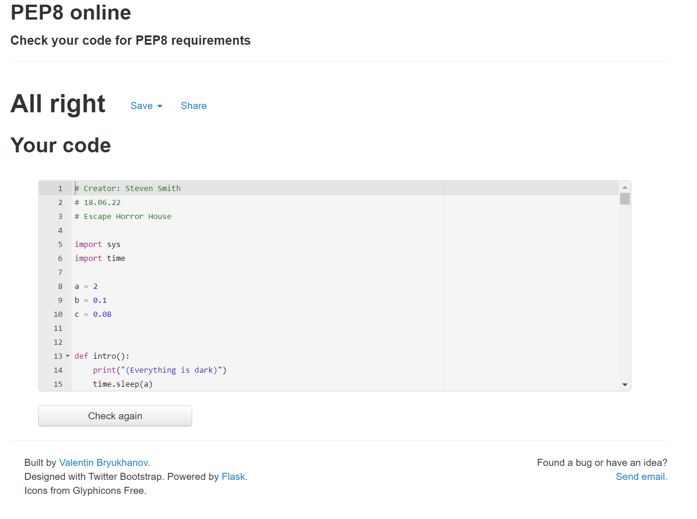

# Escape Horror House

* [Introduction](https://github.com/ssmi8/Escape_Horror_House#introduction)
* [Design](https://github.com/ssmi8/Escape_Horror_House#design)
* [Development Cycle](https://github.com/ssmi8/Escape_Horror_House#development-cycle)
    - [Decision Tree](https://github.com/ssmi8/Escape_Horror_House#decision-tree)
* [UX](https://github.com/ssmi8/Escape_Horror_House#ux)
    - [User Stories](https://github.com/ssmi8/Escape_Horror_House#user-stories)
* [Testing](https://github.com/ssmi8/Escape_Horror_House#testing)
    - [PEP8 Testing](https://github.com/ssmi8/Escape_Horror_House#pep8-testing)
* [Errors](https://github.com/ssmi8/Escape_Horror_House#errors)
* [Deployment](https://github.com/ssmi8/Escape_Horror_House#deployment)
* [Future Improvements](https://github.com/ssmi8/Escape_Horror_House#future-improvements)
* [Credits](https://github.com/ssmi8/Escape_Horror_House#credits)

## Introduction

This a small interactive adventure game that challenges the player to try and escape from a horror house after being held captive by a mysterious person. There is only one way out and many ways to be caught, trying to escape. We use a command line interface to let the user interact with the game. The user will make their decisions based on the scenario they find them selves in and their decisions will ultimately win the game or lose the game.

## Design

The main design idea was to lead the user/player on a simple text adventure that will only have one winning outcome but many ways for the user/player to become recaptured.  The idea of having one successful path is to encourage the user to keep trying to find a solution to the game, whist being capdivated by the storyline.

## Development Cycle

At the beginnig of the project I wanted to make sure I had a good understanding of what the storyline was going to be and how I was going to structure the paths/options for the user.

I used the following development steps in order to complete this project:

* Create a basic story line
* Create a decision tree
* Finalise the story at each decision
* Code the logic using with functions and if/elif
* Add time delay effect for text

### Decision Tree

## UX

### User Stories

* As a user I would like to know what game I am playing
* As a user I want to be able to interact with the game.
* As a user I want to be able to distinguish between the choices I must make in the game.
* As a user I would want to know if I win or lose the game
* As a user I would like the option to play again or quit the game

## Testing

This section provides details of testing performed during development. 

Testing was done as each change was saved.

* Within Gitpod I used the termial to pass through the text/game to understand the changes I made.
* As well as this, it allowed me to spot and fix potential errors in the game instead of finding these out at the end.

### PEP8 Testing

I ran my code through the PEP8 validator, which came up with no issues - "All Right"

## Errors

* Upon playing the game and testing the functionality, I noticed that one of the decisions led to the wrong path.  I corrected this by referring it to the correct functions.
* I noticed on a number of lines, it exceeded the character lengths so I amended the text to make sure it all fit.
* When testing I realised the restart function did not work, where I has misspelt the text which was corrected.

## Deployment

The live deployed application can be found here: [Escape Horror House](https://escape-horror-house.herokuapp.com/)

### Creating an Application with Heroku

I used the video tutorial provided by The Code Institute to create a Heroku account, add the details of the app and deploy the application to a live environment.

* Log into Heroku
* Click New
* Give the app a name and choose the region
* Click on settings first and set the Reveal Config Vars
* PORT = Key 8000 = Value
* If using CREDS please make sure this has been added to the requirements file.
* Add build pack include Python and Node.js
* The order of the buildpacks is important, in the list Python should be first with Node.js second. If they are not in this order, you can click and drag them to rearrange.
* Click Deploy at the top to go to the Deployment settings
* Choose GiHub as the deployment method
* Search for your app and connect
* Use Automatic deploys if you would like a new build when changes are pushed to GitHub from Gitpod
* Use Manual deploy for a new build every time this button is clicked.
* Once completed click View App

## Future Improvements

Add more difficult levels/paths to the the game to challenge users more and create a more detailed storyline.  The user would be able to build upon each level of the game.

## Credits

### Reference Material

* I used Python Tutor Code.
* I used W3 Schools to help with the coding.
* I used youtube video tutorials to help with some examples of functionality.
